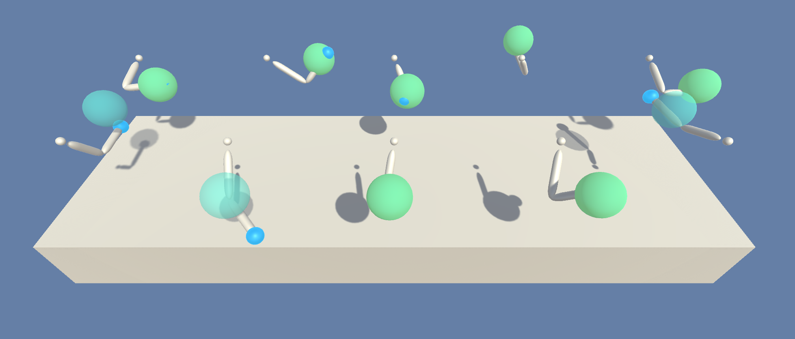

# P2_continuous_control_DRLND

In This project, one can work with [Reacher](https://github.com/Unity-Technologies/ml-agents/blob/master/docs/Learning-Environment-Examples.md#reacher) Environment.



In the given environment, a double-jointed arm can move to catch the ball(Target). The observation space consists of 33 variables corresponding to position, rotation, velocity, and angular velocities of the arm. Each action is a vector with four numbers, corresponding to torque applicable to two joints. If the end effector of arm is reached to ball, Agent gets instant reward of +1 and -1 for not reaching to target. The goal of your agent is to maintain its position at the target location for as many time steps as possible.

Provided Two separate versions of the Unity environment:

    * The first version contains a single agent.
    * The second version contains 20 identical agents, each with its own copy of the environment.

The second version is useful for algorithms like PPO, A3C, and D4PG that use multiple (non-interacting, parallel) copies of the same agent to distribute the task of gathering experience. 

One can follow given instructions and solve version 1 by this project which gives 30+ average reward over 100 consicutive episodes.

## prerequisite installation:

* please follow the instructions in the [DRLND GitHub repository](https://github.com/udacity/deep-reinforcement-learning) to set up your Python environment. By following these instructions, you will install PyTorch, the ML-Agents toolkit, and a few more Python packages required to complete the project.

* Download the unity environment:
  * [Linux](https://s3-us-west-1.amazonaws.com/udacity-drlnd/P2/Reacher/one_agent/Reacher_Linux.zip)
  * [Mac OSX](https://s3-us-west-1.amazonaws.com/udacity-drlnd/P2/Reacher/one_agent/Reacher.app.zip)
  * [Windows (32-bit)](https://s3-us-west-1.amazonaws.com/udacity-drlnd/P2/Reacher/one_agent/Reacher_Windows_x86.zip)
  * [Windows (64-bit)](https://s3-us-west-1.amazonaws.com/udacity-drlnd/P2/Reacher/one_agent/Reacher_Windows_x86_64.zip)
  
## Train the agent:

open jupyter notebook by terminal:
```
jupyter notebook
```

change kernel ***python3*** to ***drlnd***:


After following the instructions above, open Continuous_Control.ipynb 

And run every cell except:
```
env.close()
```
In the end, one can get average reward graph plot over the every episodes.


