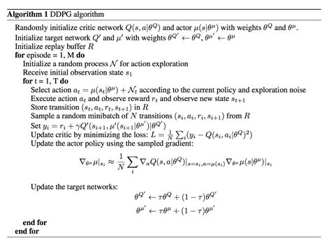
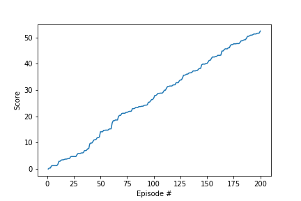

DDPG(Deep Deterministic policy gradient) present an actor-critic, model-free algorithm based on the deterministic policy gradient that can operate over continuous action spaces. It is not possible to straightforwardly apply Q-learning to continuous action spaces, because in continuous spaces finding the greedy policy requires an optimization of actions at every timestep; this optimization is too slow to be practical with large, unconstrained function approximators and nontrivial action spaces.  Instead, here we used an actor-critic approach based on the DPG algorithm

In this method One can create neural network for actor and critic both.
The achitecture for both as structured below:

Actor NN achitecute:

***Input state(33) -> hidden_1 (256) -> output_action (4)***

Critic NN architecture:

***Input state (33) -> concat_with_action (256+4) -> hidden_1(256) -> hidden_2(128) -> output_action (1)***

The hyperparameters:

  * Buffer size: 1,000,000
  * Batch size: 64
  * Actor nn learning rate: 0.0001
  * Critic nn learning rate: 0.0003
  * discount factor: 0.99
  * weight decay: 0.0001
  * tau: 0.001

We have passed training dataset randomly 10 times to train actor and critic network. 

## plot of average reward over total episodes:

## Future idea:

For the Future, we can use D4PG(Distributed Distributional Deterministic Policy Gradients). It combines continuous control setting within a distributed framework for off-policy learning. It also combines simple improvements such as the use of N-step returns and prioritized experience replay. 
